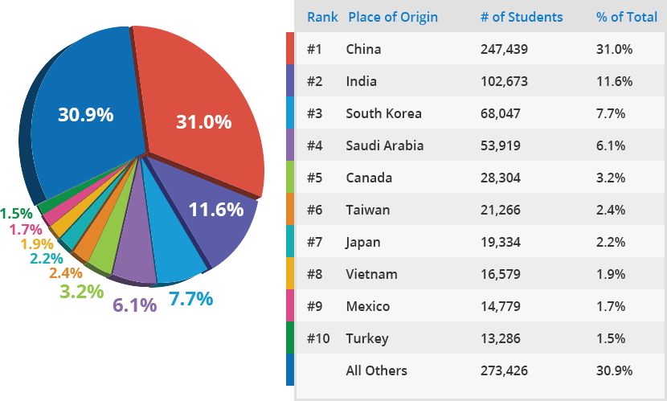
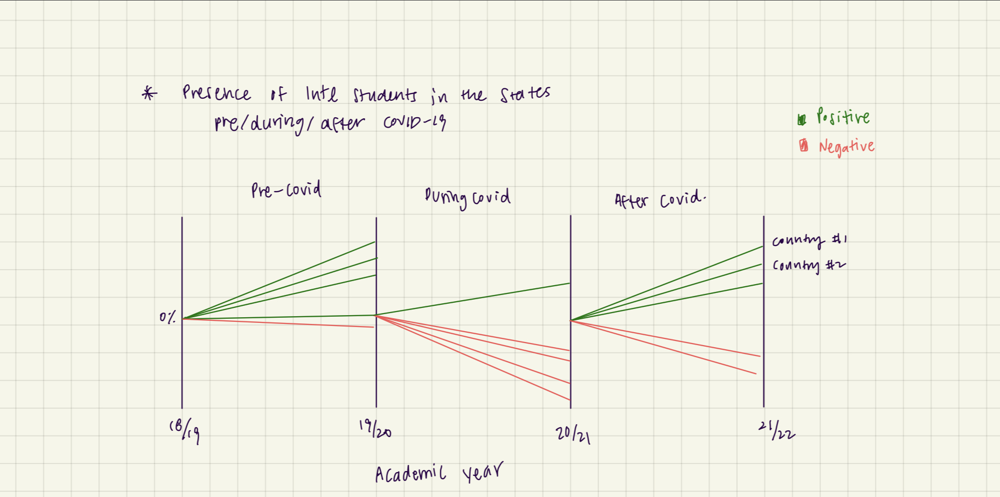

| [home page](https://cmustudent.github.io/tswd-portfolio-templates/) | [visualizing debt](visualizing-government-debt) | [critique by design](critique-by-design) | [final project I](final-project-part-one) | [final project II](final-project-part-two) | [final project III](final-project-part-three) |

# Critique By Design

## I. Original Visualization
As an international student myself, I have always been interested in the enrollment of international students in the US and the breakdown of the numbers by country. Below is a visualization titled "By the Numbers: Who Sends the Most Students to Study in the U.S.?" as part of an article that provides a guide to the international students who plan to study in the US. The article uses _Open Doors_ as its source of data, which has long been regarded as the information resource on international students in the United States. 

- Source: https://www.affordablecollegesonline.org/international-students-guide-studying-in-usa/

I will critique this visualization and create a redesign to improve on some of the aspects that could be worked on.

## II. Critique

| Category       | Score |
| -------------- | ----- |
| Usefulness     |   5   |
| Completeness   |   6   |
| Perceptibility |   6   |
| Truthfulness   |   4   |
| Intuitiveness  |   8   |
| Aesthetics     |   6   |
| Engagement     |   6   |

*Notes on aspects that need improvements:*
- A lot of colors. Between the pie chart and the table, the author indicated the matching color from the pie chart on the left side of the table, but because there are too many colors, it’s difficult to keep track which color indicates which country.
- 3d pie charts. This type of visualization is not recommended as it can distort the size of the area in the pieces, and therefore wrongly represent the values of each piece. For instance, 31% in red looks much bigger than 30.9% in blue, even though it’s only 0.1% difference.
- Lack of key message. I think the author could do a little better to further develop the key message of the visualization. Right now, the visualization shows the top 10 countries in the world with most international students in the US, but it ends there. It would be better if there was a specific key message that the visualization targeted for the audience. For example, the visualization could tell a story about how the numbers changed for each country before and after the pandemic. (Key message: the number of foreign students studying in the United States fell sharply during the 2020/21 academic year) I would also update the data to represent the most relevant academic years as of now. 

## III. Initial Sketch

## IV. User Feedback
- Feedback #1 by mid-20's male student:
1) The message is clear. It is a visualization that shows percentage of students decreasing during the covid period but has since picked up.
2) Would like to see the magnitude of the change (include percentage values)
3) Think about the intended audience. Is it people in the education industry? Could be the government?

- Feedback #2 by mid-20's female student:
1) Confused why the line starts at 0% again for every academic year. it can be misleading
2) add the % value for the line. Instead of starting from 0%, continue the prev line.
3) Add pop-up that shows the raw count as well (in order to prevent misleading perceptions of the magnitude of the count)
4) Might want to develop a specific story to highlight using the visualization
5) Dont' spread out the labels of the countries too much - try to keep the gaps in scale so that the user has a better idea of the differences between countries.
6) 
  
## V. Redesign

Process:
- While in the process of redesigning, I noted there are limitations with the Flourish platform. For example, I wanted to color the background of the chart with different colors to differentiate the positive range and the negative range. However, Flourish only offers one choice of color to color the background. Another important part of the chart was to label the y-axis (0% at the initial node) so that I
