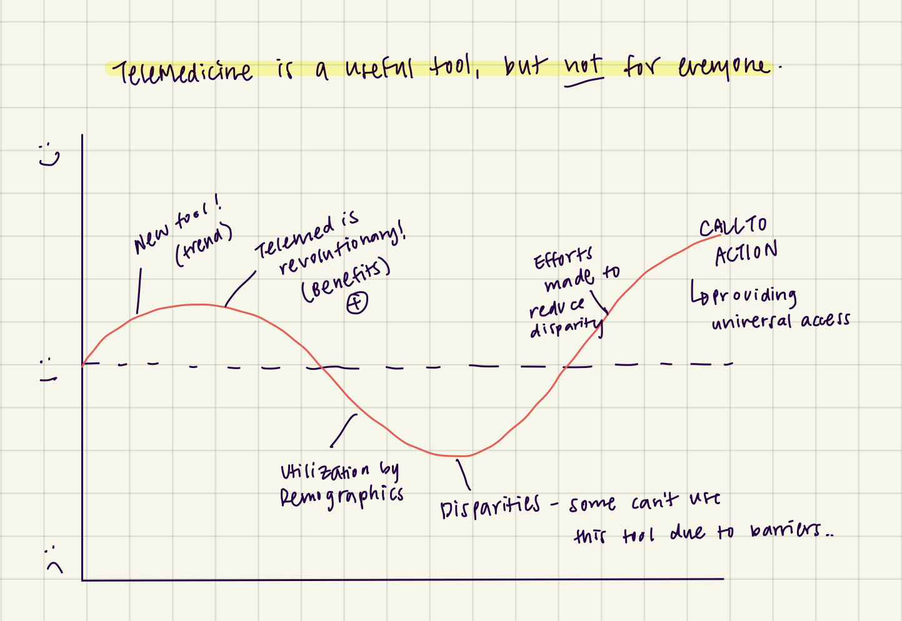
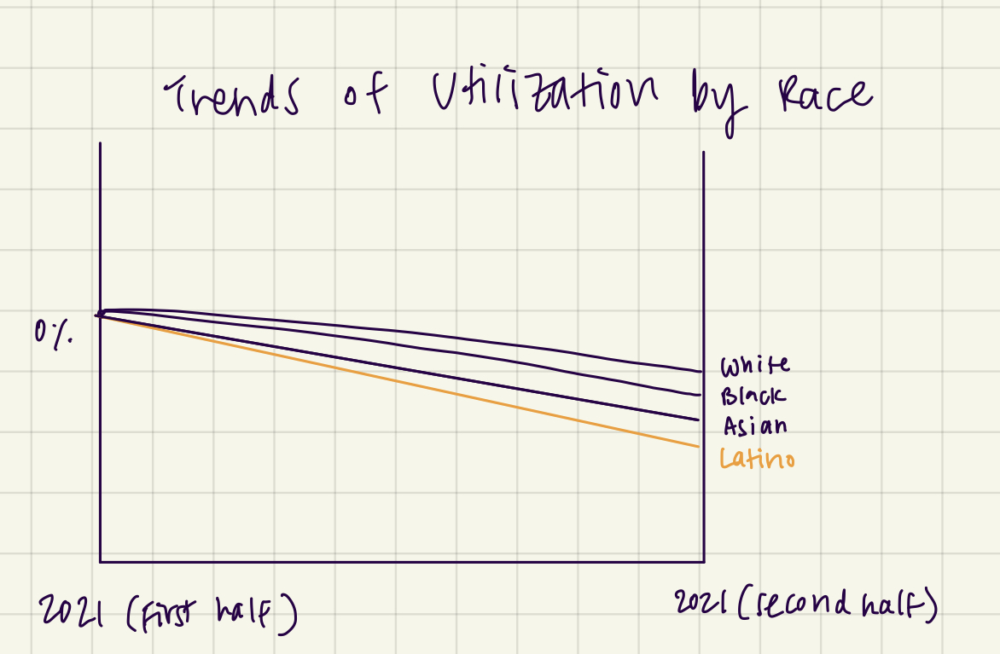

| [home page](https://talktalki.github.io/grace_portfolio/) | [visualizing debt](visualizing-government-debt) | [critique by design](critique-by-design) | [final project I](final-project-part-one) | [final project II](final-project-part-two) | [final project III](final-project-part-three) |

## Outline
TeleMedicine has become a useful tool for healthcare providers to deliver healthcare to patients, especially after the pandemic. Benefits of telemedicine include improved access to care, convenience, and slowing spread of disease. However, with the rise of utilization, we have also consequently seen the disparities of utilization across different sociodemographic and geographic characteristics. The aim of this project is to inform the audience of the existing disparities with telemedicine utilization and in response, provide an example of successful interventions of reducing these barriers. The intended audience for this project is primarily healthcare providers and healthcare operations, but patients can also be part of the audience.

**Project structure**
- Story Arc

- One-line summary: TeleMedicine is a useful tool, but *not* to everyone.
- User story: As a reader, I want to understand the disparities in telemedicine utilization so that I can make this tool a universal one.
- Call to action: I can do this by employing interventions to reduce disparities at my facility.

## Initial sketches
- Trend over the years

- Disparities over different sub-groups (by region, age, education level, income level, language preference, etc)

- Geo-spatial map

## Dataset

| Name | Description |
|------|-------------|
| NCHS-NHIS  | National Center for Health Statistics collects and analyzes health data and statistics. National Health Interview Survey (NHIS) is a nationally representative household survey of the US population, and is conducted yearly - typically conducted in respondents’ homes or over the telephone. This dataset provides trends in use of telemedicine of the patients in the recent years. This can inform the readers of the impactful role of telemedicine during the pandemic. |
| NCHS-NEHRS | National Electronic Health Record Survey collects information on both office-based physicians’ adoption and use of electronic health record (EHR) systems. This dataset will give us information on the shift in trend of telemedicine usage for providers between 2019 and 2021. |
| Telemedicine Use in the Last 4 Weeks | The U.S. Census Bureau, in collaboration with five federal agencies, launched the Household Pulse Survey to produce data on the social and economic impacts of the COVID-19 pandemic on American households. The Household Pulse Survey was designed to gauge the impact of the pandemic on employment status, consumer spending, food security, housing, education disruptions, and dimensions of physical and mental wellness. The data was collected over the periods April 2021 through August 2022. |
| Medicare Telehealth Trends | This dataset provides information about people with Medicare who used telehealth services between January 2020 and March 2023. This dataset also divides the data by demographic characteristics of the patients. |

1) https://www.cdc.gov/nchs/data/databriefs/db445-tables.pdf#1 
2) https://www.cdc.gov/nchs/nehrs/questionnaires.htm
3) https://data.cdc.gov/NCHS/Telemedicine-Use-in-the-Last-4-Weeks/h7xa-837u
4) https://www.census.gov/programs-surveys/household-pulse-survey/datasets.html
5) https://data.cms.gov/summary-statistics-on-use-and-payments/medicare-service-type-reports/medicare-telehealth-trends

## Method and medium
I will execute this project using the Shorthand platform.
